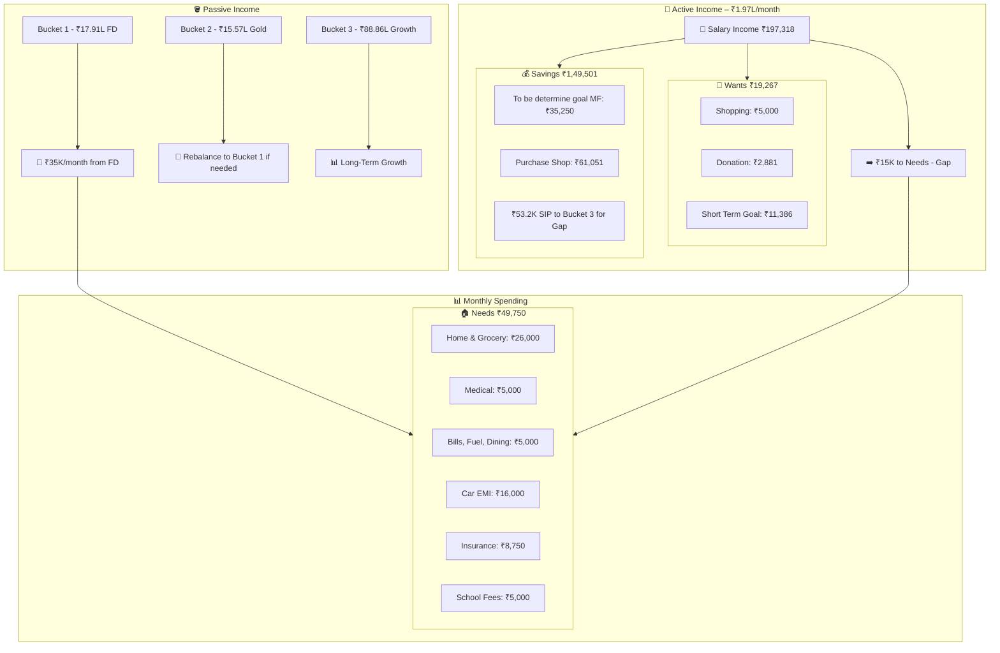
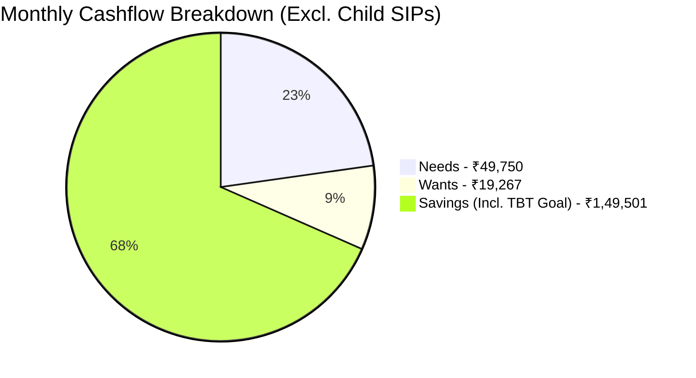
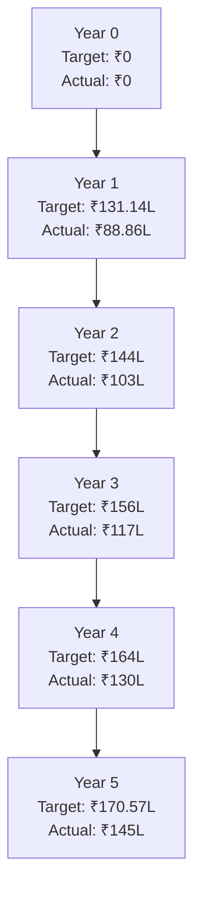
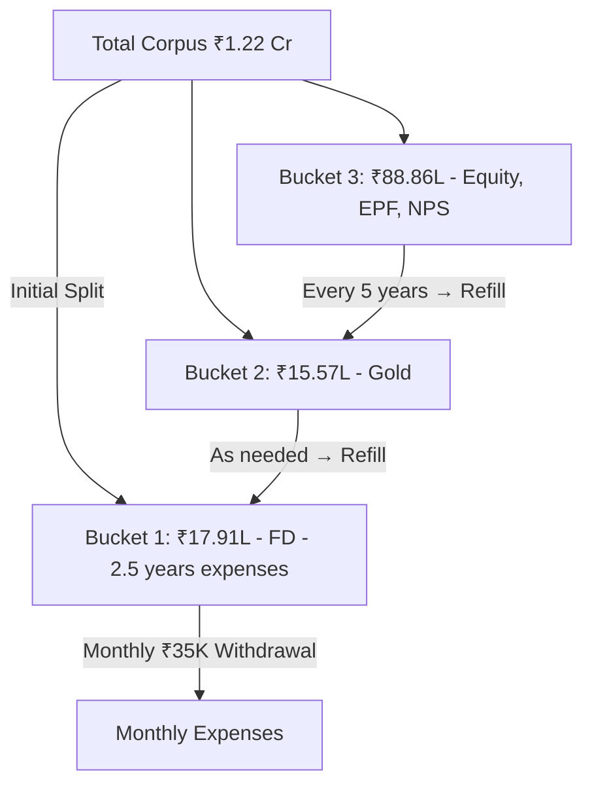
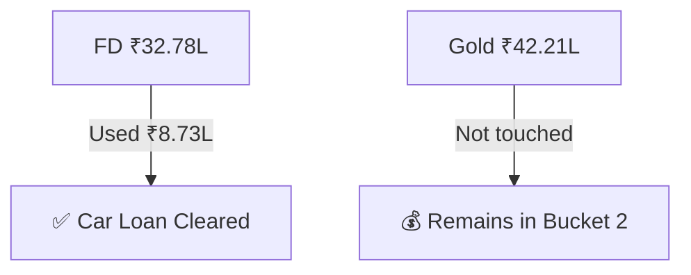

# FIRE 3-Bucket Strategy Plan

## 👤 Profile Summary

- **Age**: 35
- **Current FIRE Status**: Not retiring yet — testing FIRE system by withdrawing from assets
- **SWR (Safe Withdrawal Rate)**: 3.5%
- **Current Monthly Expense Target**: ₹50,000 (today's value)
- **Able to Cover from Assets Today**: ₹35,000/month
- **Gap to Cover (from salary now)**: ₹15,000/month
- **Monthly Salary**: ₹197,318
- **Target**: Build full FIRE corpus in 5 years via SIPs to cover full ₹50K (inflation-adjusted)

---

## 🔄 Unified FIRE Monthly Flowchart (Income + Cashflow)

---

## 🪣 3-Bucket Structure

### 🪣 Bucket 1 – Safety Bucket

- **Purpose**: 2–3 years of fixed expenses (₹35K/month)
- **Corpus**: ₹17.91L in Fixed Deposit
- **Covers**: 36 months of ₹35K/month
- **Withdrawals Begin**: Immediately (FIRE simulation)

### 🪣 Bucket 2 – Buffer/Gold Bucket

- **Purpose**: Support bucket 1 in downturns; rebalancing reserve
- **Corpus**: ₹15.57L (Reduced Gold due to car loan payoff)
- **Gold Allocation**: Yes, entire Bucket 2 can be in gold if:

  - You accept some price volatility
  - You have low correlation with equities
  - Liquidity is maintained (ETFs or Sovereign Gold Bonds preferred)

### 🪣 Bucket 3 – Growth Bucket

- **Purpose**: Long-term compounding
- **Corpus Today**: ₹88.86L (Updated MF/NPS/EPF data)
- **Target Corpus in 5 Years**: ₹170.57L (inflation adjusted)
- **Gap**: ₹68.83L
- **SIP Needed**: ₹53,200/month for 5 years @11% CAGR

---

## 📊 Updated Monthly Cashflow – Excluding Child SIPs

---

## 📊 Fund Composition – Bucket 3 (Updated)

- **Parag Parikh Flexi Cap Fund**: ₹23.39L
- **Kotak Large & Midcap Fund**: ₹12.81L
- **Franklin India ELSS Tax Saver**: ₹2.77L
- **Kotak Arbitrage Fund**: ₹0.5L
- **Axis Short Duration Fund**: ₹0.4L
- **NPS**: ₹1.79L
- **EPF**: ₹14.47L
- **Add future SIPs**: ₹53.2K/month

### Diversified SIP Suggestions

- **Parag Parikh Flexi Cap (Top-Up)**
- **Mirae Asset Large Cap Fund**
- **ICICI US Bluechip / Nasdaq FOF**
- **Nippon or Quant Small Cap (max 10%)**
- **ICICI Balanced Advantage (optional stability)**

---

## 📈 5-Year Asset Growth Trajectory (Vertical)

---

## 🧮 3-Bucket Withdrawal Logic

---

## 🛞 Car Loan Adjustment

---

## ❓ Emergency Fund – Optional?

Since Bucket 1 already holds 2–3 years of expenses in safe, liquid assets, a **separate emergency fund is optional**. However, you may consider:

- Keeping ₹1–2L in a sweep-in savings account for unexpected medical or repair expenses
- Using a credit card buffer backed by a gold/SGB auto-redeem plan for last-resort emergencies

---

## ⚠️ Cons & Areas for Improvement

### 🔴 Cons:

- **Gold Volatility**: Bucket 2 entirely in gold may fluctuate in value
- **Equity Market Timing Risk**: SIPs rely on expected returns; short-term underperformance can delay targets
- **Healthcare Costs Uncertainty**: ₹5K/month may be inadequate in future; consider health corpus separately
- **FD Rate Risk**: Renewals in Bucket 1 may face lower interest rates over time

### 🟢 Suggestions for Improvement:

- Diversify Bucket 2 to include balanced advantage/hybrid debt-equity funds (like ICICI Balanced Advantage)
- Review inflation assumption annually (currently \~6%)
- Use a goal-based investing tool to track progress monthly
- Consider partial annuity for fixed income after age 50
- Prepare exit strategy for smallcaps if risk spikes
- Add health and term insurance corpus buffer after age 45
- If asset performance exceeds projection, reduce SIP or retire early

---

## ✅ Next Steps

1. Begin actual **withdrawals from Bucket 1** immediately
2. Start **₹53,200 SIP**, automate it
3. Maintain ₹1–2L separate for true emergencies (optional)
4. Review inflation, returns and asset performance **annually**
5. Consider shifting part of Bucket 2 to a balanced hybrid fund if gold becomes volatile
6. Rebalance buckets every 2 years

---

Would you like a downloadable PDF version of this file?
